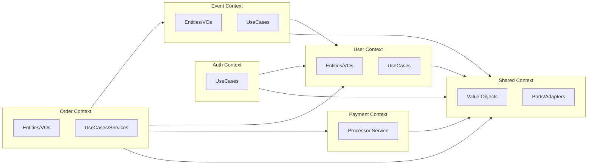
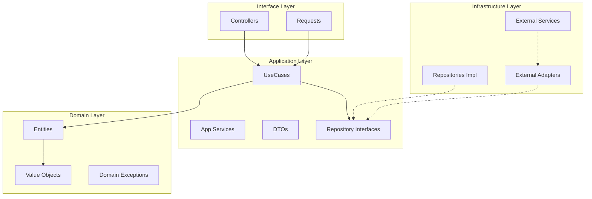
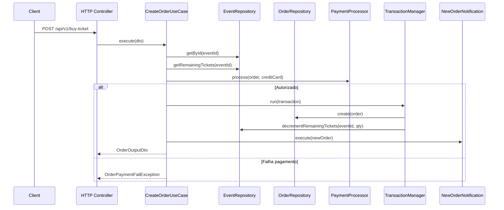
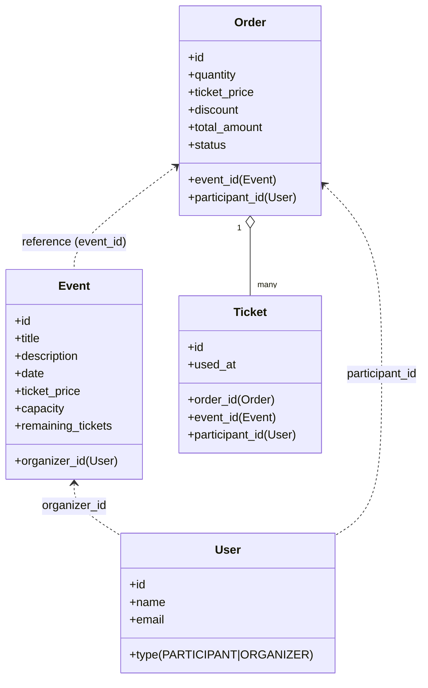

# Event Hub

Sistema de gerenciamento de eventos com venda de ingressos, processamento de pagamentos e notificações.

## Requisitos

    

## Configuração Inicial

### Configuração e inicialização do projeto

```bash
# Copiar arquivo de ambiente
cp .env.example .env

# Inicialize os containers Docker
docker-compose up -d

# Instalar dependências
docker-compose exec eventhub.api composer install

# Executar comandos de inicialização
docker-compose exec eventhub.api bash -c "php artisan key:generate && php artisan migrate && php artisan db:seed && php artisan migrate --env=testing"
```

Após a inicialização e execução dos containers, os seguintes recursos estarão disponíveis:

| Serviço | Porta | Descrição                          | Como acessar |
|---------|-------|------------------------------------|--------------|
| **Laravel (API)** | `80` | Aplicação principal                | http://localhost/api/v1/ |
| **MySQL** | `3306` | Banco de dados                     | `localhost:3306` |
| **Workers** | - | Processamento de filas | `php artisan queue:work --queue=notifications` |
| **Documentação** | - | Swagger/OpenAPI | http://localhost/docs* |

<small>* Para gerar a documentação Swagger, execute: <code>php artisan l5-swagger:generate</code></small>


## Parâmetros

O projeto possui parâmetros customizáveis no arquivo `.env`:

```env
API_RATE_LIMIT_PER_MINUTE=60      # Limite de requisições por minuto
AUTH_TOKEN_LIFETIME_SECONDS=3600  # Tempo de vida do token (1 hora)
MAX_TICKETS_PER_ORDER=5           # Máximo de ingressos por pedido
MAX_TICKETS_PER_EVENT=15          # Máximo de ingressos por evento por usuário
```

Os cupons de desconto são hardcoded no sistema:

| Código | Desconto |
|--------|----------|
| `BLACKFRIDAY` | 50% |
| `PROMO30` | 30% |
| `10OFF` | 20% |

## Testes

Para rodar a suíte de testes com PHPUnit (Unit, Feature e E2E):

```bash
php artisan test
```

## Arquitetura e Design

A aplicação segue um design modular com DDD e princípios de Clean Architecture. Abaixo, alguns gráficos para orientar a navegação pelo código e entender dependências e fluxos.

### 1) Visão DDD (Bounded Contexts e dependências)



Legenda:
- Cada módulo encapsula suas entidades, casos de uso e portas/repos.
- Shared concentra VOs, exceções e contratos (adapters/ports) usados por vários módulos.

### 2) Camadas (Clean Architecture)



Regras:
- Interface depende de Application; Application depende de Domain.
- Infrastructure implementa as portas definidas em Application/Domain e é injetada de fora.

### 3) Fluxo: Compra de Ingressos (buy-ticket)



### 4) Agregados e Relacionamentos (alto nível)



Notas:
- Event é um agregado próprio e não carrega Order/Ticket.
- Order é agregado raiz dos Tickets (composição); relaciona-se a Event e User por ID.
- User é agregado independente (usado por Auth, Event e Order).
